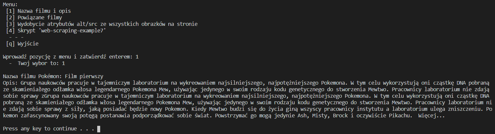
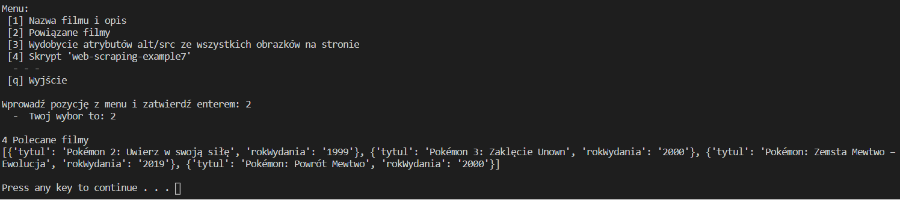
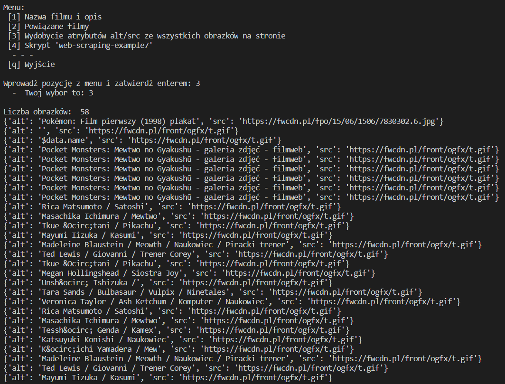
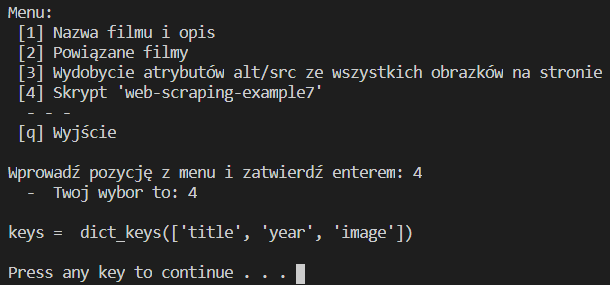

Celem laboratorium było zapoznanie się z web-scrappingiem z użyciem BeautifulSoup. Przeanalizowałem i wdrożyć kod z repozytorium do zajęć, na przykładzie Filmwebowej podstrony o moim ulubionym filmie z dzieciństwa. Poniżej działanie poszczególnych skryptów:

