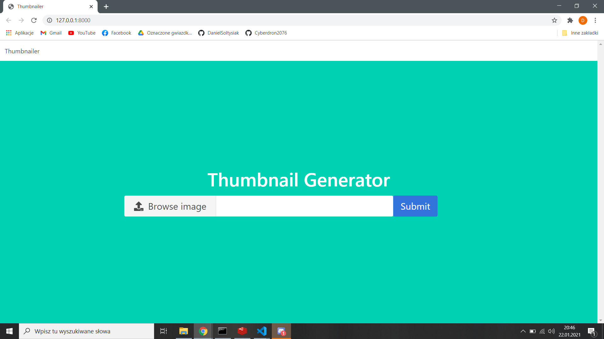
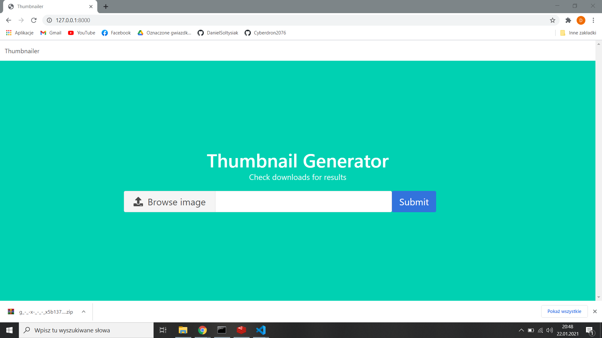
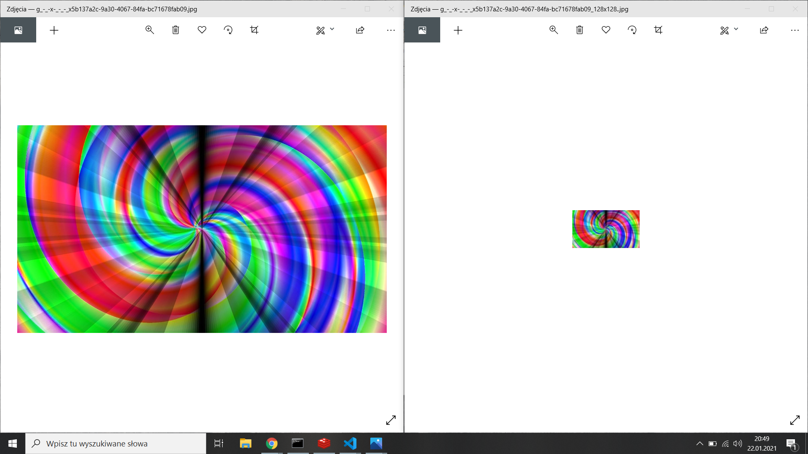

# Aplikacje Internetowe Lab 7

Celem laboratorium było zapoznanie się z Redisem. Poznanie jego możliwości z pomocą tutoriala [Redis i Python – dobrze dobrana para](https://mmazurek.dev/tag/redis-i-python/?order=asc). Po poznaniu Redisa należało użyć go wraz z Celery do stworzenia aplikacji tworzącej miniatury obrazu. [Asynchronous Tasks in Django with Redis and Celery](https://stackabuse.com/asynchronous-tasks-in-django-with-redis-and-celery/).

## Działanie aplikacji

### Widok aplikacji

### Pobranie spakowanej miniatury

### Efekt

