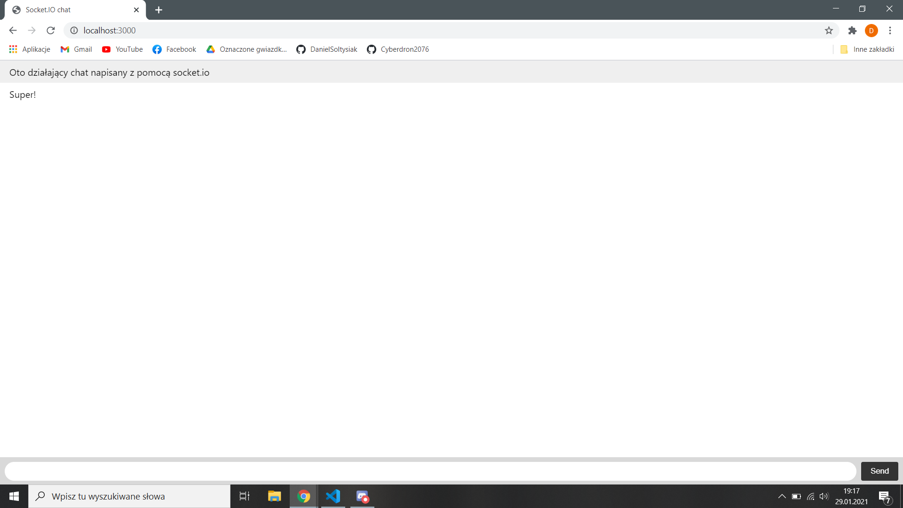
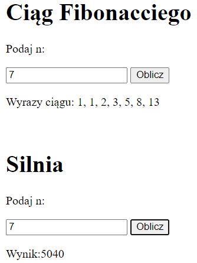

# Aplikacje Internetowe Lab 8

## Part I - WebSockets

W części I celem laboratorium było zapoznanie się z WebSocketami, oraz wykonanie prostego chata z wykorzystaniem django-channels lub socket.io. Wybrałem drugą opcję i skorzystałem z tutoriala z [oficjalnej strony socket.io](https://socket.io/get-started/chat/).

## Part II - Web Workers

W części II celem było zapoznanie się z Web Workerami i zaimplementowanie dwóch.

