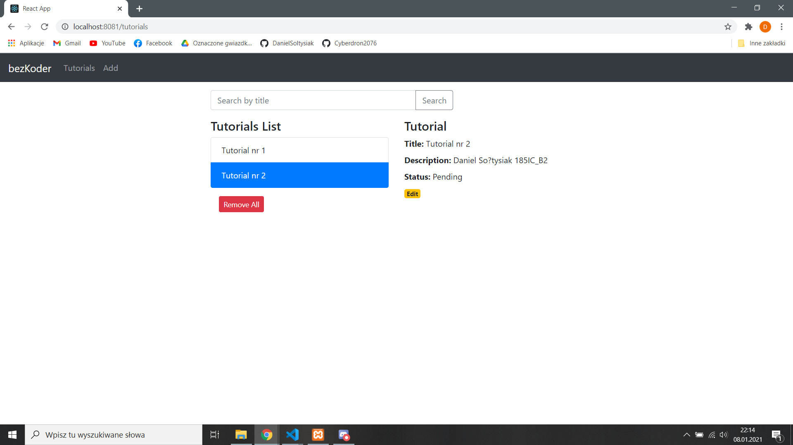
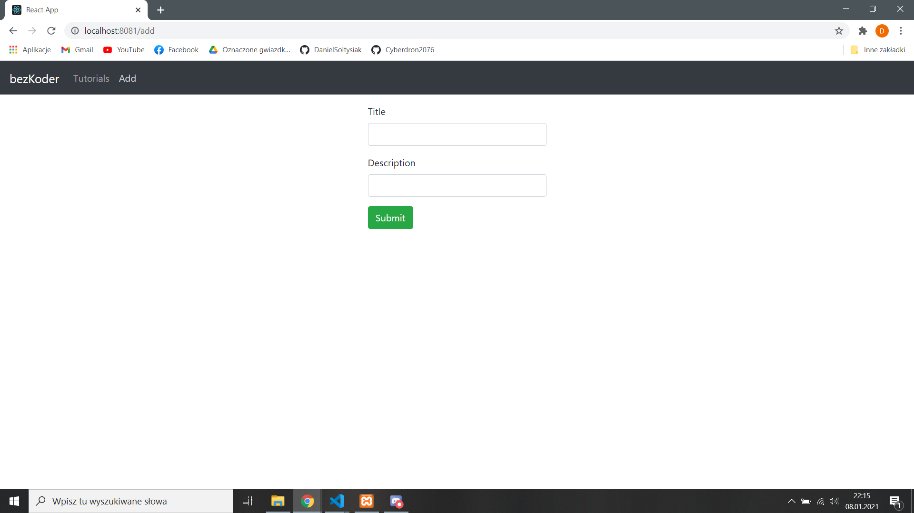
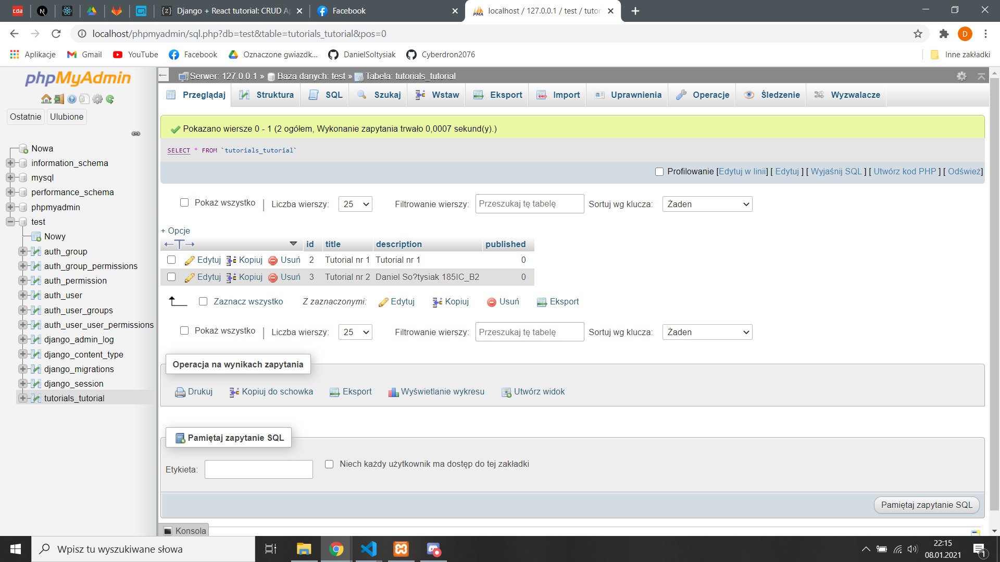

# Aplikacje Internetowe Lab 9

Celem laboratorium było wykonanie aplikacji CRUD. z pomocą [Django + React tutorial: CRUD App with Axios & Rest Framework](https://bezkoder.com/django-react-axios-rest-framework/) z backendem w Django i forntendem w Reacie. 
 
Do wykonania zadania skorzystałem z bazdy danych MySQL. W celu ułatwienia zarządzania bazą skorzystałem z programu XAMPP.

## Strona po dodaniu tutoriali

W opisie tutoriala znajduje się moje imię i nazwisko potwierdzające że wykonałem laboratorium.

## Widok dodawania tutoriali

## Tutoriale w bazie danych

Na zrzucie ekranu z phpMyAdmin widać że w bazie danych znajdują się tutoriale ze strony. 