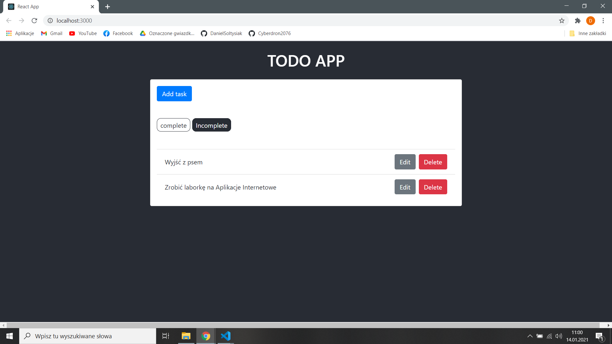
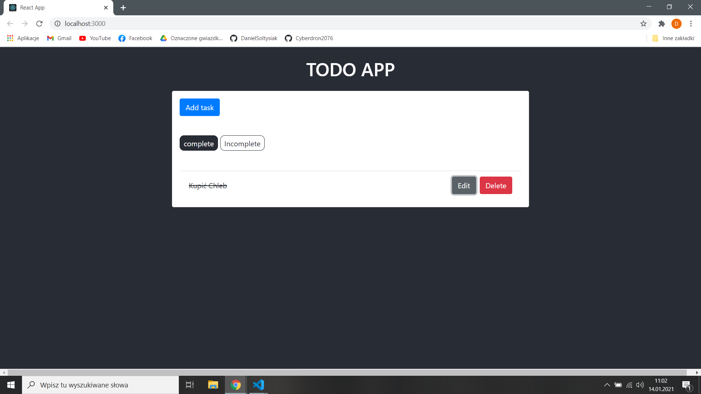
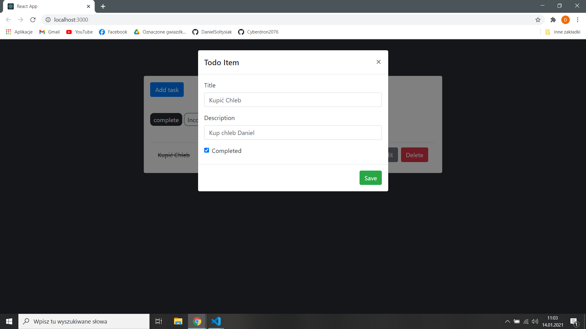

# Aplikacje Internetowe Lab 10

Celem laboratorium było wykonanie aplikacji ToDo. z pomocą tutoriala [Build a To-Do application Using Django and React](https://www.digitalocean.com/community/tutorials/build-a-to-do-application-using-django-and-react) z backendem w Django i forntendem w Reacie. 

## Działanie aplikacji

### Zadania do wykonania

### Wykonane zadania

### Modal

