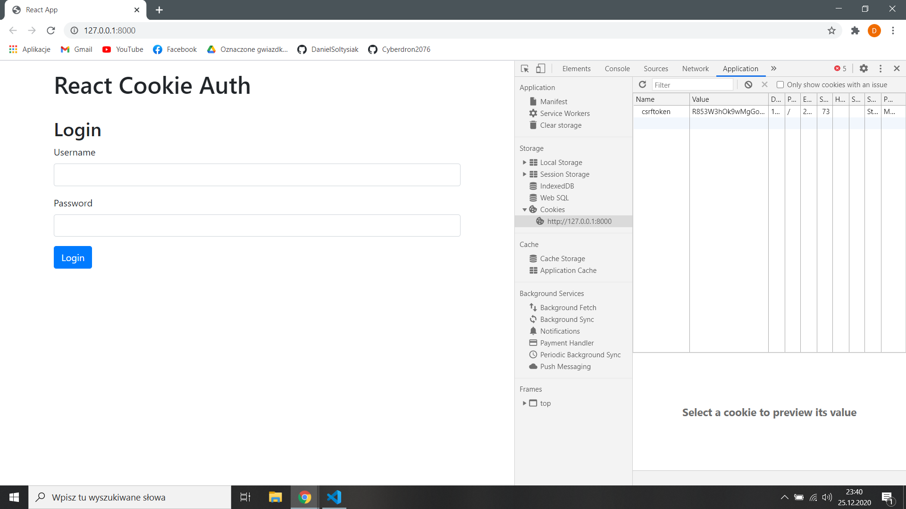
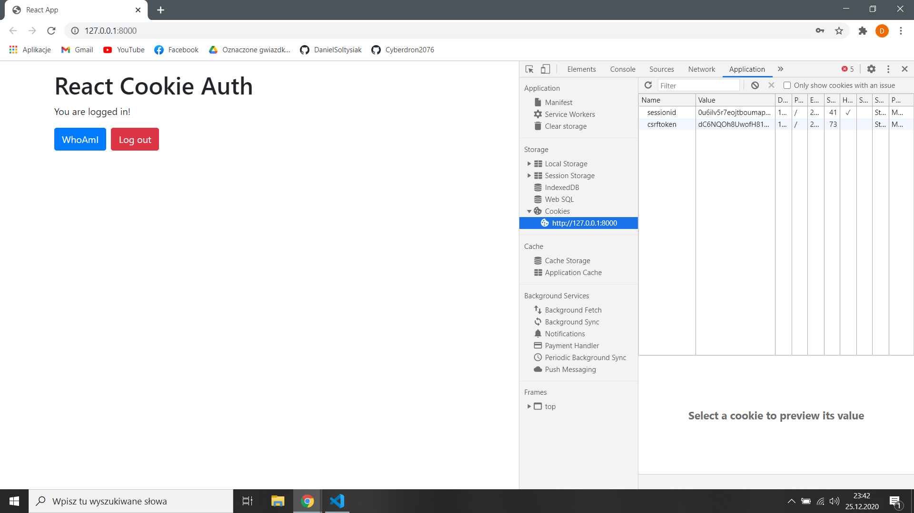
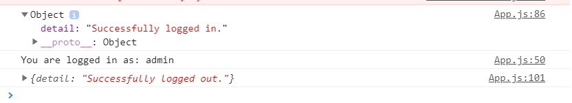

Ekran logowania. W zakładce aplication/cookies można zauważyć crsftoken.

Po zalogowaniu wyświetla się session id.

Poniżej komunikaty z konsoli po zalogowaniu, naciśnięciu przycisku "Who I am" i wylogowaniu

